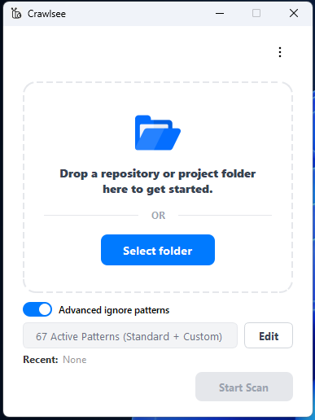
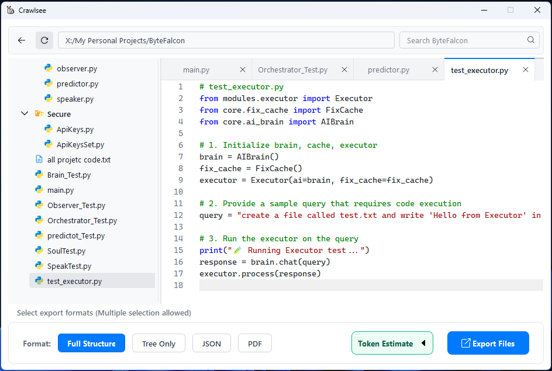
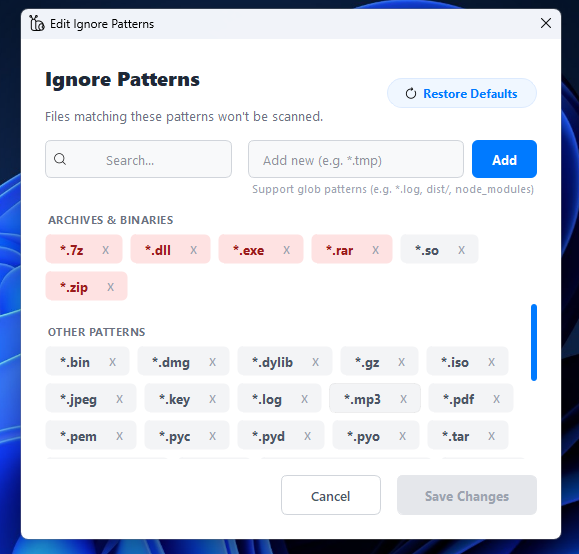
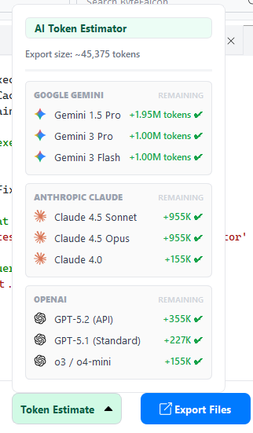
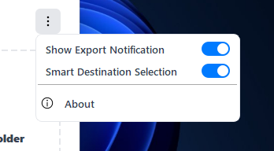

<div align="center">
  

  <h1 style="margin-bottom: 0.2em;">Crawlsee</h1>

  <p style="font-size: 1.1em; color: #666; margin-top: 0;">
    Full Project Context for AI, Documentation &amp; Backup
  </p>
</div>

# Crawlsee — Full Project Context for AI, Documentation & Backup

## What Is Crawlsee?

**Crawlsee** is a desktop tool that scans any project folder and exports its **full structure + code** in a clean, readable format.

It is built to solve one core problem:

> **AI and humans fail to understand projects when context is incomplete or unstructured.**

Crawlsee prepares **complete, controlled, AI-ready project context** — without zipping folders or uploading files one by one.

Everything runs **locally**.

---

## ⭐ Top 3 Core Features (Why People Use Crawlsee)

### 🥇 1. AI-Ready Full Project Context (No Confusion)

Crawlsee exports:

* full folder tree
* exact file paths & names
* readable code content (safe & ordered)

**Why it matters:**
AI understands the *whole project*, not random snippets.

---

### 🥈 2. Token Estimation Before Export (AI-Safe)

Crawlsee estimates how many **AI tokens** your export will use **before you export**.

**Why it matters:**
You avoid AI errors like *"input too long"* or silent truncation.

---

### 🥉 3. Ignore Files & Folders (Full Control)

You decide **what is included and excluded**:

* folders (`node_modules`, `dist`)
* file types (`*.png`, `*.log`)
* generated or noisy files

**Why it matters:**
Cleaner exports, fewer tokens, better AI results.

---

## What Problems Does Crawlsee Solve?

| Problem                    | How Crawlsee Fixes It          |
| -------------------------- | ------------------------------ |
| AI gets confused           | Full structure + code in order |
| Zips are useless for AI    | AI-ready text output           |
| Files missed accidentally  | Controlled scanning            |
| Token limits hit           | Token estimation before export |
| Large projects crash tools | Safe scanning with limits      |

---

## Key Features (Explained Simply)

### 🏠 Clean Start Window

Crawlsee greets you with a minimal, drag-and-drop interface:



*Simple and focused - just drag your project folder to begin.*

### 📁 Project Scanning

* Scans folders safely
* Handles large projects
* Pause / resume / stop anytime

**Useful for:** big repos, legacy code, monorepos

---

### 🌲 Accurate Folder Tree

* Preserves exact hierarchy
* Keeps file relationships clear
* **Right-click context menus** for quick actions on files and folders

**Useful for:** AI understanding architecture, human clarity


*Right-click on folders for quick actions like expand/collapse and export.*


*Right-click on files for instant preview and copy path options.*

---

### 📄 Code Preview (VS Code-Like)

* Click a file → preview instantly
* Syntax-highlighted code
* Image preview for assets

**Useful for:** quick inspection without opening IDE



*VS Code-style editor with syntax highlighting and file tree.*

---

### 🚫 Ignore Files & Folders

* Advanced ignore patterns
* Supports glob rules (`*.png`, `dist/`)
* Persistent across sessions

**Useful for:** removing noise, saving tokens



*Easy-to-use ignore pattern manager with predefined templates.*

---

### 🧠 AI-Ready Export System

Export formats:

* **Full Structure + Code**
* **Tree Only**
* **JSON**
* **PDF (with TOC & bookmarks)**

**Useful for:** AI prompts, documentation, audits


*Multiple export format options with visual indicators - select any combination you need.*

---

### 🔢 Token Estimation (Short & Clear)



*Real-time token count preview before export.*

**What are tokens?**
AI reads text in *tokens* (not pages or files). Large text = more tokens.

**Example (Gemini):**

* Too many tokens → AI rejects or cuts input
* Cut input → wrong answers

**What Crawlsee does:**

* estimates tokens before export
* helps you choose safer formats (tree vs full)
* prevents failed AI prompts

**Result:**
You export only what AI can safely understand.

---

### 🔍 Search & Filter

* Search files instantly
* Filter large trees in real time

---

### 🧠 Smart UI & Intent Awareness (New!)



*Smart Destination Selection and Export Notifications accessible from the More menu.*

Crawlsee doesn't just work for you; it **understands** you.

* **Smart Destination Selection**: 
  - **Learns Your Habits**: If you export to the same folder 5+ times, Crawlsee asks if you want to make it your default export location for that project.
  - **Adapts to Change**: If you later switch folders manually (even with Smart Selection off), Crawlsee detects the shift after 3+ exports and offers to update your default.
  - **Per-Project Memory**: Each project folder remembers its own preferred export destination separately.
  - **Result**: No more navigating through folders every time—just hit export, and it goes to the right place automatically.

* **Export Success Notifications**: 
  - After each export, a sleek notification dialog appears showing the export location with a clickable link.
  - Includes "Open Folder" and "Close" buttons for quick access.
  - **"Don't show this again"** checkbox lets you disable notifications if you prefer silent exports.
  - The dialog auto-closes after 30 seconds if you don't interact with it.

* **Persistent Layout & Geometry**: Remembers your window size, screen position, and folder-tree balance. Your workspace stays exactly how you left it.

* **Format Memory**: Learns your preferred export combinations (e.g., PDF + JSON) and suggests making them your default startup view after 3+ consecutive uses.

---

### 🔄 Live Monitoring & Passive Sync

No more manual reloading. Crawlsee keeps its finger on the pulse of your project:

* **File System Watcher**: Detects if you create, move, or edit any file in your project folder while Crawlsee is open.
* **Auto-Sync**: The UI refreshes the directory tree and previews automatically, ensuring you're always looking at the latest version of your code.
* **Throttled Reloads**: Intelligent cooling periods ensure mass file operations (like `git pull` or `npm install`) don't slow down the UI.

---

### 💅 Premium VS Code-Inspired Design

Experience a professional, high-fidelity interface designed for maximum developer productivity:

* **Contextual Icon Support**: Smart icons for export chips and tree nodes that adapt dynamically.


*Rich icon set for files and folders - over 1000+ file type icons for instant recognition.*

* **Fluid UI Physics**: Smooth transitions for panel expansions and resizing for a modern, high-end desktop feel.

---

### 📦 One-File Backup

* Export entire project into one readable file
* Archive code outside Git

**Useful for:** long-term backup, sharing, documentation

---

## Common Use Cases

| Use Case               | How Crawlsee Helps         |
| ---------------------- | -------------------------- |
| AI project explanation | Full context in one export |
| Refactoring with AI    | No missing files           |
| Documentation          | Clean, structured output   |
| Onboarding             | Easy project understanding |
| Backup                 | One readable snapshot      |

---

## What Crawlsee Is NOT

* ❌ Not an IDE
* ❌ Not a code editor
* ❌ Not an AI model
* ❌ Not a cloud service

It does **one job**:
**prepare perfect project context**.

---

## Why Crawlsee Instead of Zipping?

| Zip File           | Crawlsee            |
| ------------------ | ------------------- |
| AI can't read      | AI-ready text       |
| Structure hidden   | Structure preserved |
| Manual cleanup     | Automatic           |
| No token awareness | Token estimate      |

---

## Installation

### Prerequisites
- Python 3.8+
- Windows / macOS / Linux

### Setup

```bash
git clone https://github.com/abdulkarim20-ui/crawlsee.git
cd crawlsee
pip install -r requirements.txt
python main.py
```

---

## Usage

1. Launch Crawlsee
2. Drag & drop a project folder (or browse)
3. Review structure and preview files
4. Select export formats
5. Export safely with size warnings and token estimates

---

## Project Structure

```
Crawlsee/
├── assets/
├── src/
│   ├── backend/
│   │   ├── analyzers/
│   │   └── managers/
│   ├── frontend/
│   │   ├── components/
│   │   └── styles/
│   └── config.py
├── ignore_patterns.json
├── main.py
└── requirements.txt
```

---

## Tech Stack

* Python
* PyQt5 (Desktop UI)
* QScintilla (Code preview)
* ReportLab (PDF export)

Runs **fully offline**.

---

## Philosophy

> **AI is only as good as the context you give it.**
> Crawlsee exists to give *clean, complete, controlled context*.

---

## Who Should Use Crawlsee?

* Developers using AI seriously
* Teams documenting real projects
* Engineers exploring unfamiliar code
* Anyone tired of broken AI context

---

## License

MIT License — free for personal and commercial use.

---

## Icon Credits

This project uses SVG icons derived from the
Material Icon Theme for Visual Studio Code.

Copyright (c) 2025 Material Extensions  
License: MIT License

Source:
https://github.com/material-extensions/vscode-material-icon-theme

---

## Author

Created and maintained by **Abdulkarim Shaikh**

- GitHub: [https://github.com/abdulkarim20-ui](https://github.com/abdulkarim20-ui)

